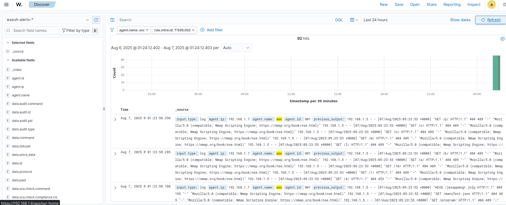

#  Task 3 – Web Reconnaissance Attack Detection (Apache + Nmap) + MITRE ATT&CK Mapping

##  Summary

This task simulates a **web reconnaissance** scenario using the **Nmap Scripting Engine (NSE)** against a target Apache server monitored by Wazuh. The objective was to trigger recon-related alerts and validate if Wazuh detects HTTP error patterns indicative of automated scanning.

---

##  Attack Simulation

- **Attacker IP:** `192.168.x.x` (Kali)
- **Target IP:** `192.168.x.x` (Ubuntu SOC box with Apache2)
- **Attack Tool:** `Nmap` with HTTP scripts
- **Command Used:**
  ```bash
  nmap -p 80 --script http-enum,http-methods,http-errors,http-headers 192.168.x.x
  ```
- **Goal:** Trigger abnormal HTTP requests and 404/405/501 responses to simulate a reconnaissance phase.

---

## MITRE ATT&CK Mapping

| Tactic           | Technique Name            | Technique ID  |
|------------------|---------------------------|---------------|
| Reconnaissance   | Vulnerability Scanning     | T1595.002     |

Wazuh correctly correlated the repeated access to non-existent URLs and methods (GET `/HNAP1`, PROPFIND `/`, POST `/sdk`, etc.) as evidence of **automated scanning activity**.


---

##  Detection Details (Wazuh Alerts)

###  Wazuh Agent:
- **Agent Name:** `soc`
- **Log Source:** `/var/log/apache2/access.log`

###  Sample Alert (Parsed)

```json
{
  "rule.id": "31151",
  "rule.level": 10,
  "rule.groups": ["web", "accesslog", "web_scan", "recon"],
  "rule.description": "Multiple web server 400 error codes from same source ip.",
  "rule.mitre.id": "T1595.002",
  "data.srcip": "192.168.1.x",
  "data.protocol": "PROPFIND",
  "data.url": "/",
  "decoder.name": "web-accesslog"
}
```



### 🧾 Alert Evidence:

#### 🔹 Example 1 (Recon):
```
"PROPFIND / HTTP/1.1" 405 521 "-" "Mozilla/5.0 (compatible; Nmap Scripting Engine)"
```

#### 🔹 Example 2 (404s):
```
"GET /.git/HEAD HTTP/1.1" 404 453 "-" "Mozilla/5.0 (compatible; Nmap Scripting Engine)"
"POST /sdk HTTP/1.1" 404 453 "-"
"GET /HNAP1 HTTP/1.1" 404 453 "-"
```

These indicate directory enumeration and probing for admin/config paths — a common recon tactic.

---

##  Wazuh Rule Highlights

| Rule ID | Level | Description                                           | MITRE TTP   |
|---------|-------|-------------------------------------------------------|-------------|
| 31101   | 5     | Web server 400 error code.                            | ✖️ (Generic) |
| 31151   | 10    | Multiple web server 400 error codes from same IP.     | ✅ T1595.002 |
| 31121   | 4     | Web server 501 error code (Not Implemented).          | ✖️ (Generic) |

---

##  Logs Correlated

- **Decoder Used:** `web-accesslog`
- **Correlated Field:** `data.srcip` = `192.168.1.x`
- **Log Patterns Triggered:**
  - HTTP 404: Not Found
  - HTTP 405: Method Not Allowed
  - HTTP 501: Not Implemented

---
## 📋 Incident Report for Executives

This lab also simulates a real-world SOC workflow by preparing a formal **incident report** targeting non-technical stakeholders and higher-ups. The report outlines the attack scenario, detection, and risk context from a business perspective.

📎 [Download Full Executive Incident Report (PDF)](incident_report.pdf)

##  Conclusion

This task demonstrates how Wazuh effectively detects web reconnaissance activity by correlating Apache logs and recognizing repeated access to invalid paths and methods. MITRE T1595.002 was correctly mapped via default rules, showcasing the SIEM's power in spotting early attacker behavior.

---


> *Documented as part of my  SIEM Lab Challenge using Wazuh, Apache, and Nmap.*
