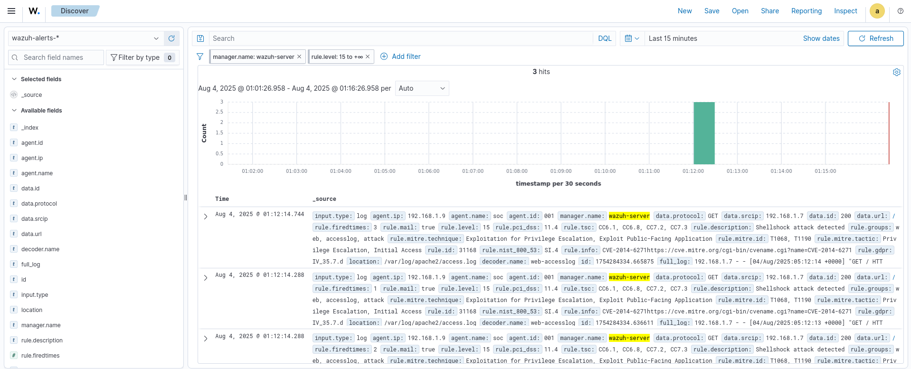

#  Task 1: Wazuh Agent Setup & Shellshock Detection

##  Lab Setup
- **Attacker**: Kali Linux 
- **Victim**: Ubuntu Server 24.04 with Wazuh Agent 
- **SIEM**: Wazuh OVA in VirtualBox (Wazuh Manager + Web UI)

##  Steps Completed
- Registered the Ubuntu server as a Wazuh agent
- Modified Wazuh agent config to monitor:
  - `/var/log/apache2/access.log`
- Simulated a Shellshock-style RCE attack from Kali

##  Attack Details: Shellshock (CVE-2014-6271)

| Field | Details |
|-------|---------|
| **Attack Type** | Remote Code Execution |
| **Exploit** | Shellshock (Bash vulnerability) |
| **CVE** | [CVE-2014-6271](https://cve.mitre.org/cgi-bin/cvename.cgi?name=CVE-2014-6271) |
| **Source IP** | 192.168.1.7 (Kali) |
| **Target Log File** | `/var/log/apache2/access.log` |
| **Rule ID** | 31168 |
| **Rule Description** | Shellshock attack detected |
| **Rule Level** | 15 (Critical) |

## 🎯 MITRE ATT&CK Mapping

- **Tactic**: Initial Access
  - **Technique**: [T1190 – Exploit Public-Facing Application](https://attack.mitre.org/techniques/T1190/)
- **Tactic**: Privilege Escalation
  - **Technique**: [T1068 – Exploitation for Privilege Escalation](https://attack.mitre.org/techniques/T1068/)

###  Detection Screenshot:

